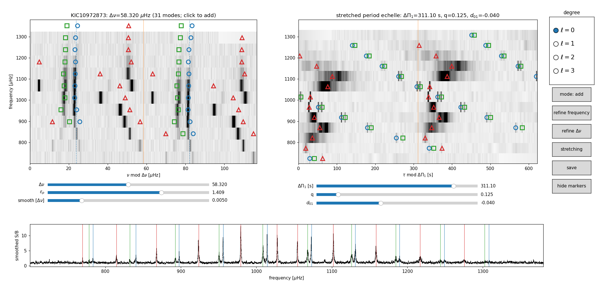

# clickelle

**Click modes on an echelle diagram, then fit them.**

clickelle is an interactive front end for asteroseismic peakbagging: the
part that comes *before* any heavy Bayesian machinery. You identify
modes by clicking on a (stretched) echelle diagram, refine the guesses,
and get per-mode Lorentzian frequencies with honest errors and a
detection statistic — without bells and whistles.

It was built for solar-like oscillators with mixed modes (subgiants and
red giants), where automated mode identification struggles and a human
with a stretched period echelle is still the most reliable instrument.

## Install

```
pip install git+https://github.com/parallelpro/clickelle.git
```

Requires Python >= 3.10. Dependencies: numpy, pandas, matplotlib, and
jax + optax for the fitting step. Add `pyarrow` if your spectra live in
parquet files.

## Input

Both commands take a **background-normalized power spectrum** (S/B): a
CSV or parquet table with a frequency column in uHz and a power column,
where the granulation background + white noise have been divided out so
the continuum is ~1. Column names are auto-detected (`freq_uHz`/`freq`/
`frequency`/`nu` and `snr`/`power`/`psd`/`ps`), or set them with
`--freq-col`/`--power-col`. Any background-fitting tool works for
producing it (e.g. your own Harvey-profile fit, pySYD, ...).

## Try it on real data

The `examples/` directory ships a ready-made session for the Kepler
subgiant KIC 10972873: a background-normalized short-cadence spectrum
trimmed to the oscillation window, and 31 tagged modes with tuned
Δν/ε_p/ΔΠ₁/q. All parameters (including ν_max) are restored from the
saved session, so no flags are needed:

```
cd examples
clickelle init KIC10972873_snr.csv --star KIC10972873   # inspect / edit the tags
clickelle fit  KIC10972873_snr.csv --star KIC10972873   # fit them
```

Press **stretching** in the widget to open the stretched period echelle
— the l=1 mixed modes (red triangles) line up on the wiggly vertical
ridge characteristic of a subgiant:



The fit takes a few minutes (31 modes in 18 groups, drop-one lnK refits
included) and recovers 29 detections with a median frequency error of
0.064 uHz; see the resulting
[per-group fit panels](docs/groups_fit.png).

## Step 1: tag modes interactively

```
clickelle init spectrum.csv --star KIC10972873 --numax 950
```

This opens a matplotlib window with a replicated frequency echelle
(folded at Δν), the smoothed spectrum below it, and controls:

| control | what it does |
| --- | --- |
| Δν slider | re-fold the echelle live |
| ε_p slider | dashed guide at the expected l=0 ridge position |
| degree radio | which l a click assigns (l=0 circles, l=1 triangles, l=2 squares, l=3 diamonds) |
| mode: add/remove | what a click does |
| refine frequency | snap every guess uphill to its local maximum |
| refine Δν | linear fit of ν vs radial order to the l=0 guesses; updates Δν and ε_p |
| stretching | expand the canvas with a **stretched period echelle** (τ folded at ΔΠ₁, with ΔΠ₁/q/d₀₁ sliders) — the l=1 mixed modes line up vertically when the parameters are right, and clicking there adds l=1 modes directly |
| save | write the session |

Sessions persist: `save` writes `<workdir>/<star>/modes_init.csv` and
`params_init.csv` (Δν, ε_p, ΔΠ₁, q, d₀₁, smoothing, ν_max), and the next
`clickelle init` for the same star restores everything.

## Step 2: fit the tagged modes

```
clickelle fit spectrum.csv --star KIC10972873
```

Each mode becomes one Lorentzian (no rotational splitting — that is a
downstream problem). Modes are grouped wherever the frequency gap
exceeds 0.25 Δν, and each group is fit independently by maximum
likelihood (χ², 2-dof spectrum statistics) with jax + optax, with
1-σ errors from the Hessian.

Every mode also gets a cheap evidence proxy: the group is refit without
it, and

```
lnK = [lnL(with) − lnL(without)] − (3/2) ln N_bins
```

is a BIC-approximated log Bayes factor. `lnK > 0` flags a detection;
`lnK > 5` is strong. Skip this with `--no-quality` for speed.

Outputs land in the session directory:

- `modes_freqs.csv` — `l, fc_init, fc, e_fc, height, e_height, gamma,
  e_gamma, dlnL, lnK, detected, group, n_bins`
- `groups_fit.png` — one panel per group: data, model, init vs fitted
  positions, lnK per mode

## Python API

Everything is importable if you'd rather stay in a notebook or script:

```python
import clickelle

nu, snr = clickelle.load_spectrum('spectrum.csv')

# the widget (needs an interactive matplotlib backend)
clickelle.launch('KIC10972873', nu, snr, numax=950)

# the fit, on any table of guesses with columns 'l' and 'fc'
out, panels = clickelle.fit_modes(nu, snr, guesses, dnu=57.0)

# building blocks: echelle images and mixed-mode stretching
z, ext = clickelle.frequency_echelle(nu, snr, dnu, echelle_type='replicated')
params = clickelle.AttrDict(dnu=57.0, dpi1=110.0, q=0.15, eps_p=1.2,
                            d01=0.0, numax=950.0)
tau = clickelle.make_tau(nu, params, constant_q=True, constant_eps_p=True)
z, ext = clickelle.period_echelle(nu, snr, params.dpi1, tau=tau)
```

## License

MIT. If clickelle is useful in your research, an acknowledgment is
appreciated.
